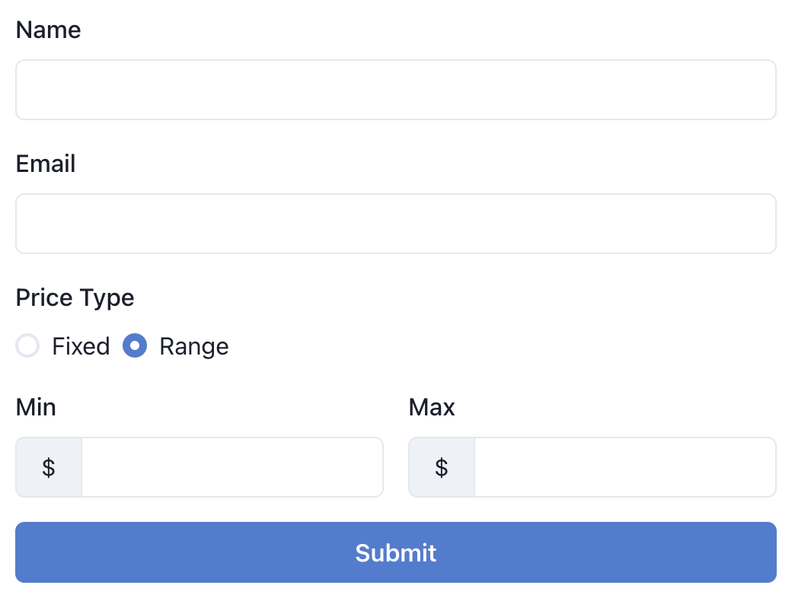
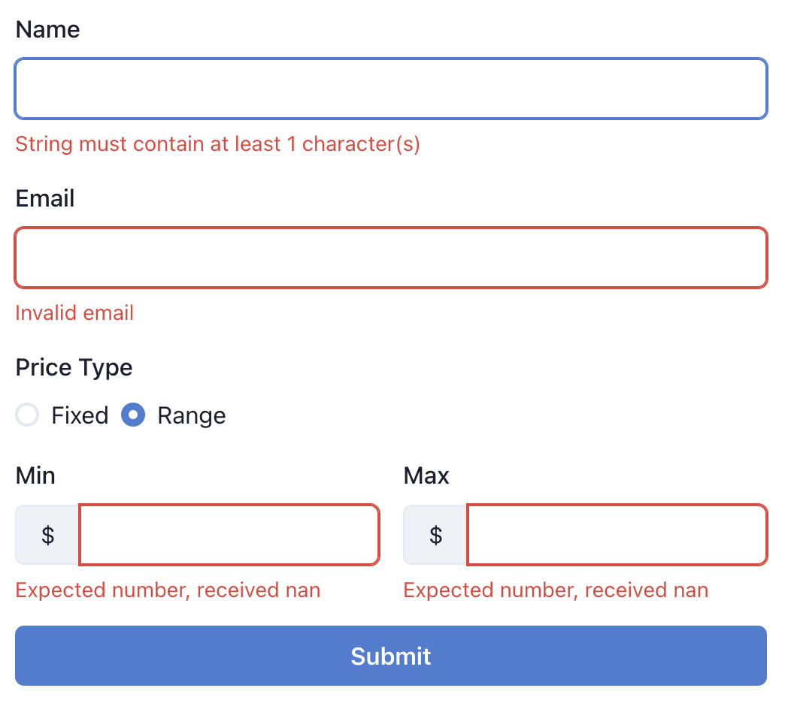

# Front end coding test

[Ignition](https://ignitionapp.com) developers use [React](https://react.dev/), [TypeScript](https://www.typescriptlang.org/), [Chakra UI](https://chakra-ui.com/), [React Hook Form](https://react-hook-form.com/) (RHF) and [Zod](https://zod.dev/) every day. In this coding exercise you'll be using all of these tools. Basic scaffolding has been set up for you so you can hit the ground running.
## Exercise
You need to build a form that validates data when submit button is pressed with all errors shown to the user as presented in the screenshot below.

We have provided some tests with this project. Use these tests to help shape the UI interactions and write a matching `zod` schema to validate the form. Your task is to write the code that makes tests pass and build UI that works as expected.

Use your imagination when building the form. If you build what is presented in the screenshot, it should be sufficient, but if you want to make it fancier - all the more power to you!

<figure class="image" style="margin-bottom: 20px">
  <figcaption>Example form</figcaption>
  
</figure>
<figure class="image">
  <figcaption>Example form with errors</figcaption>
  
</figure>

## Your Solution
Your solution must be submitted in the form of a CodeSandbox link. Clone this project to start coding away.

If you choose to code directly in CodeSandbox, there's nothing else for you to set up.

If you prefer to work on localhost in your IDE, we leave it to you to figure out all the setup steps. Just keep in mind that **final solution must be presented via CodeSandbox**.

**All code you submit must be in TypeScript**.

## Other info
This is an "open book test" - feel free to learn as you go by browsing documentation and any resource you can find on the web.

Try to make as many tests pass as you can, but don't be discouraged if you can't do it all.

This exercise may feel very specific regarding the tools we chose to work with, however they were chosen so that you can get a taste of what Ignition Engineers are dealing with on a day-to-day basis. If this is up your alley, we'll be happy to chat with you.
